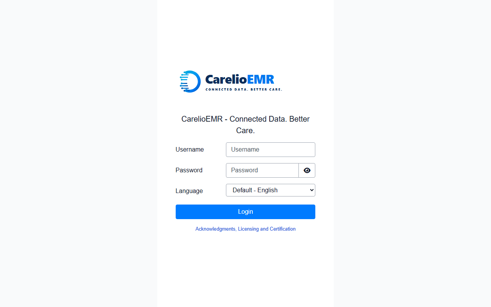
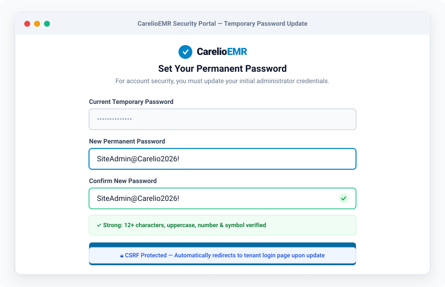
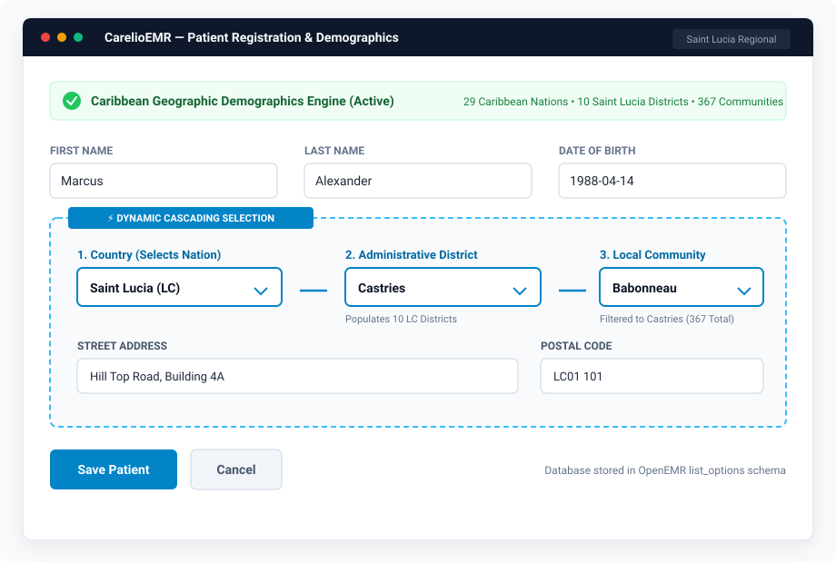
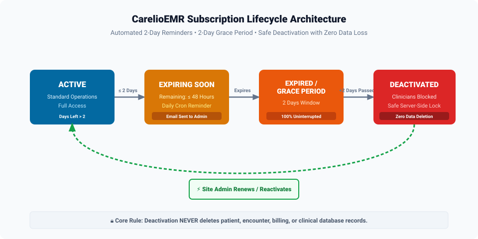
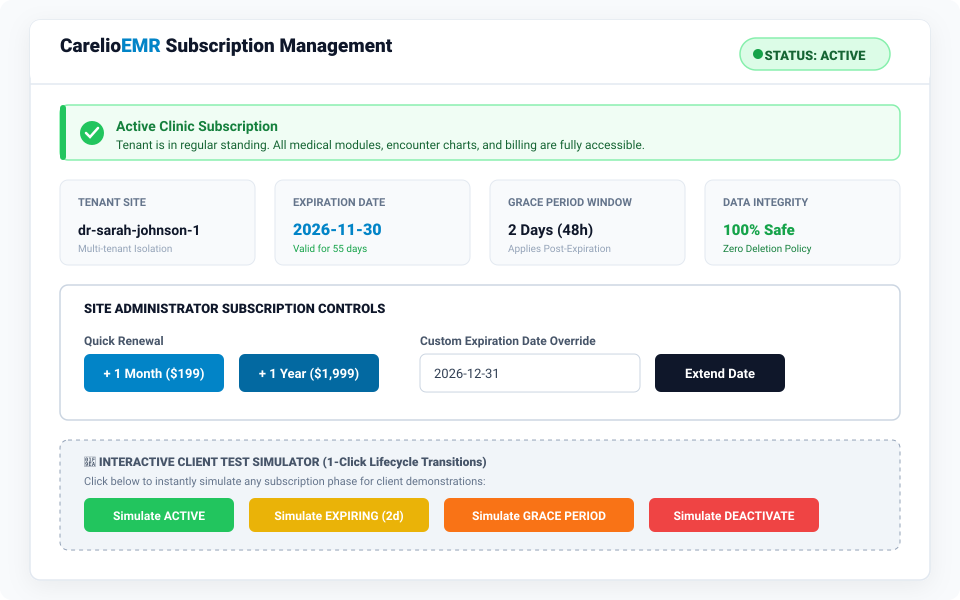
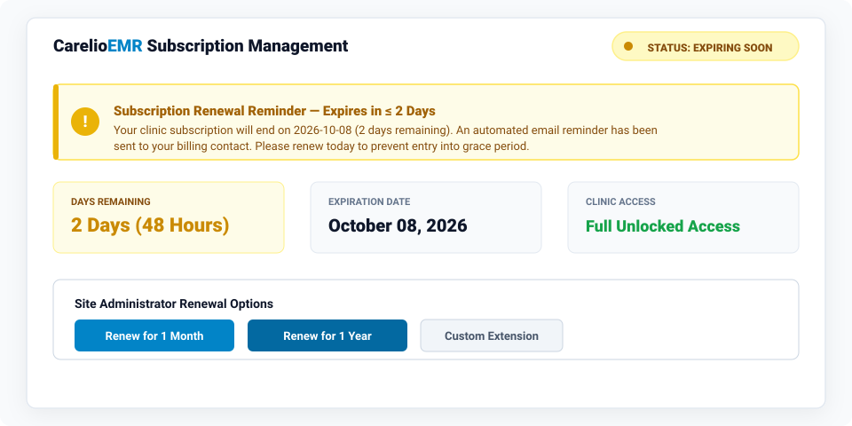
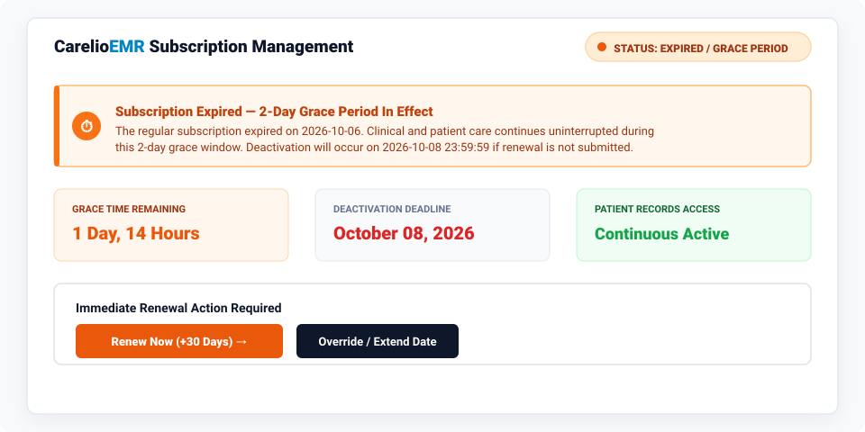
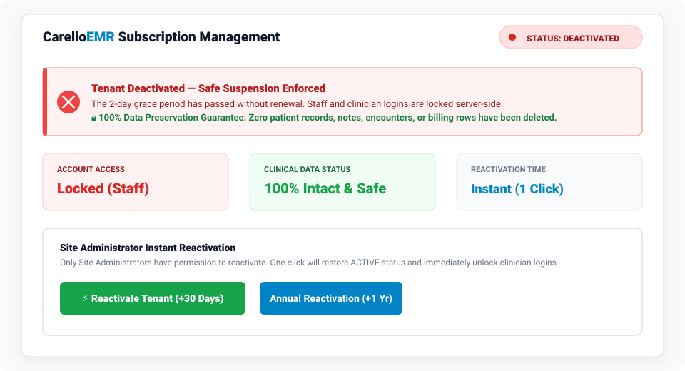
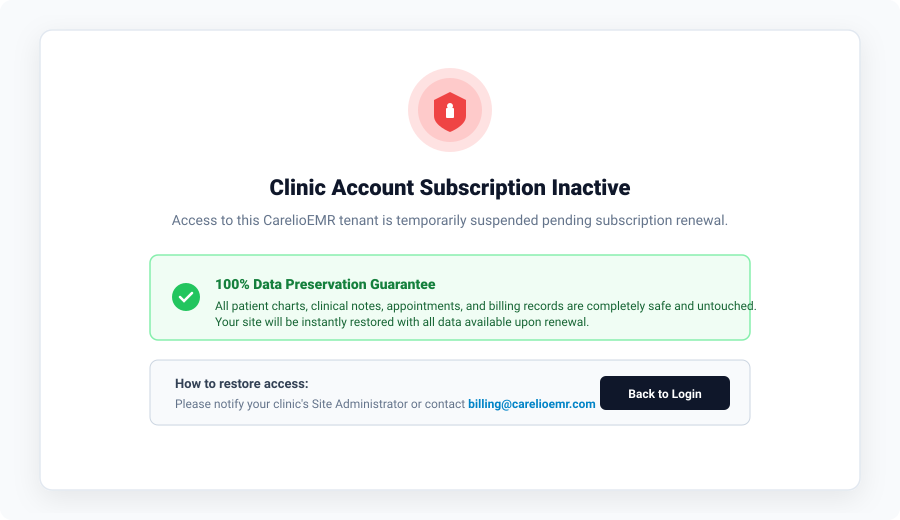

# CarelioEMR — User Manual & Operations Guide
**Product:** CarelioEMR (Multi-Tenant Clinical Platform)  
**Modules:** Site Admin Configuration (`site_admin_config`) & Subscription Management (`carelio_subscription`)  
**Target Audience:** Site Administrators, Clinic Operations Managers, and IT Teams  
**Version:** 2.0  
**Date:** October 2026  

---


# Table of Contents
1. [Introduction & Role-Based Access Matrix](#1-introduction--role-based-access-matrix)
2. [Module 1: Site Administrator Setup & Security](#2-module-1-site-administrator-setup--security)
   - [2.1 Branded Clinic Login](#21-branded-clinic-login)
   - [2.2 Mandatory First-Time Password Reset](#22-mandatory-first-time-password-reset)
   - [2.3 Caribbean Geographic Demographics (Saint Lucia)](#23-caribbean-geographic-demographics-saint-lucia)
3. [Module 2: Subscription Management](#3-module-2-subscription-management)
   - [3.1 Subscription Lifecycle Architecture](#31-subscription-lifecycle-architecture)
   - [3.2 Stage 1: Active Subscription](#32-stage-1-active-subscription)
   - [3.3 Stage 2: Expiring Soon Reminder (≤ 2 Days)](#33-stage-2-expiring-soon-reminder--2-days)
   - [3.4 Stage 3: Expired / Grace Period (2-Day Window)](#34-stage-3-expired--grace-period-2-day-window)
   - [3.5 Stage 4: Safe Deactivation & Data Preservation Guarantee](#35-stage-4-safe-deactivation--data-preservation-guarantee)
   - [3.6 Regular Clinician Lockout Screen](#36-regular-clinician-lockout-screen)
4. [Site Administrator Actions & Operations](#4-site-administrator-actions--operations)
   - [4.1 Renewing a Subscription](#41-renewing-a-subscription)
   - [4.2 Custom Expiration Date Override](#42-custom-expiration-date-override)
   - [4.3 Reactivating a Deactivated Site](#43-reactivating-a-deactivated-site)
   - [4.4 Subscription Audit Trail & History](#44-subscription-audit-trail--history)
5. [How to Test the Subscription Module (Interactive Simulator)](#5-how-to-test-the-subscription-module-interactive-simulator)
6. [Daily Automated Background Process (Scheduler & Cron)](#6-daily-automated-background-process-scheduler--cron)
7. [Frequently Asked Questions (FAQ)](#7-frequently-asked-questions-faq)

---

## 1. Introduction & Role-Based Access Matrix

CarelioEMR provides specialized clinic administration and automated subscription lifecycle monitoring built directly into the OpenEMR ecosystem. The system enforces strict role-based separation of duties:

| Role | Username Example | Permissions & Access Scope |
| :--- | :--- | :--- |
| **Super Administrator** | `admin` | Global OpenEMR system configuration, global modules (`Administration ➔ System ➔ Modules`), database maintenance. |
| **Site Administrator** | `siteadmin` | Clinic tenant management, staff creation, Caribbean demographics, **Subscription renewal/extension/reactivation** via `Administration ➔ Carelio Subscription`. |
| **Clinician / Front Desk** | `dr_johnson`, `receptionist` | Patient registration, scheduling, EHR chart notes, billing. **Read-only** subscription status banner; server-side blocked if site is deactivated. |

> [!IMPORTANT]
> Regular clinicians and staff members **cannot** renew or alter subscription terms. Subscription management is strictly restricted to users holding the **Site Administrator** permission.

---

## 2. Module 1: Site Administrator Setup & Security

### 2.1 Branded Clinic Login
Every clinic tenant features custom CarelioEMR branding across all access touchpoints, including the desktop browser favicon, login splash screen, and navigation top bar.



#### Login Instructions:
1. Navigate to your clinic URL:  
   `https://<your-domain>/oemr/interface/login/login.php?site=<tenant-site-id>`
2. Enter your **Username** and **Password**.
3. Select your language (Default: English).
4. Click **Login**.

---

### 2.2 Mandatory First-Time Password Reset
To satisfy healthcare compliance (HIPAA and regional Caribbean data protection acts), accounts issued with temporary credentials are automatically intercepted upon their first sign-in.



#### Steps to Set Permanent Credentials:
1. When prompted, enter the **Current Temporary Password** provided in your onboarding notification.
2. Enter a **New Permanent Password** meeting the security rules:
   - At least 8 characters (12+ recommended).
   - At least 1 uppercase letter (`A-Z`).
   - At least 1 number or special symbol (`0-9`, `!@#$%^&*`).
3. Confirm the new password.
4. Click **Save Password & Proceed to Login**.
5. The system will securely update your password hash and immediately redirect you back to the login page for an authenticated session.

---

### 2.3 Caribbean Geographic Demographics (Saint Lucia)
CarelioEMR comes pre-configured with complete Caribbean geographic data, supporting **29 Caribbean nations**, all **10 administrative districts of Saint Lucia**, and **367 localized communities**.



#### How It Works:
1. Navigate to **Patient / Client ➔ New / Search** in the top menu.
2. Under the **Geographic Location** section:
   - **Step 1 — Select Country:** Choose `Saint Lucia (LC)` (or any of the 29 Caribbean countries).
   - **Step 2 — Select District:** The State/District menu automatically populates with Saint Lucia's 10 administrative districts:
     - *Castries, Gros Islet, Soufrière, Vieux Fort, Micoud, Dennery, Anse la Raye, Canaries, Laborie, Choiseul*.
   - **Step 3 — Select Community:** The City/Community dropdown instantly filters to show only the localized communities belonging to the chosen district (e.g., selecting *Castries* populates *Babonneau, Bisee, Ciceron, Marchand*, etc.).
3. The cascading behavior is fast, responsive, and executes client-side without page reloads.

---

## 3. Module 2: Subscription Management

### 3.1 Subscription Lifecycle Architecture
CarelioEMR enforces an automated 4-stage subscription state machine designed to maximize clinic revenue and prevent accidental operational interruptions:



```
┌────────────────────────────────────────────────────────┐
│                        ACTIVE                          │
│     (Full clinical access, days remaining > 2)         │
└──────────────────────────┬─────────────────────────────┘
                           │
             Remaining days ≤ 2 days (48 Hours)
                           │
                           ▼
┌────────────────────────────────────────────────────────┐
│                    EXPIRING SOON                       │
│    (Email reminder dispatched, clinic 100% active)     │
└──────────────────────────┬─────────────────────────────┘
                           │
                 Subscription Expires
                           │
                           ▼
┌────────────────────────────────────────────────────────┐
│             EXPIRED / GRACE PERIOD (2 DAYS)            │
│  (Grace window active, clinic operations uninterrupted)│
└──────────────────────────┬─────────────────────────────┘
                           │
                 2 Days Grace Elapses
                           │
                           ▼
┌────────────────────────────────────────────────────────┐
│                      DEACTIVATED                       │
│       (Clinicians locked; ZERO data deleted)           │
└──────────────────────────┬─────────────────────────────┘
                           │
             Site Administrator Renews
                           │
                           ▼
┌────────────────────────────────────────────────────────┐
│                        ACTIVE                          │
│               (Access instantly restored)              │
└────────────────────────────────────────────────────────┘
```

---

### 3.2 Stage 1: Active Subscription
When a subscription is current, the dashboard displays a vibrant green badge. All clinic staff have full access to patient records, telehealth, appointment schedules, and billing.



#### Key Dashboard Metrics:
- **Tenant Site ID:** Identifies the isolated clinic database.
- **Expiration Date:** Precise end date of the active subscription period.
- **Days Remaining:** Real-time countdown to expiration.
- **Grace Period Standby:** Confirms the 2-day protection window is ready.
- **Data Integrity:** 100% safe guarantee.

---

### 3.3 Stage 2: Expiring Soon Reminder (≤ 2 Days)
When the countdown reaches **2 days (48 hours) or fewer**, the module transitions to `EXPIRING_SOON`:



#### Automated Behaviors:
- **Amber Warning Banner:** Displays across the top of the Subscription Dashboard.
- **Automated Renewal Email:** The daily background cron job dispatches an email notification to the clinic administrator and billing contact urging prompt renewal.
- **Uninterrupted Care:** Doctors and nurses experience **zero disruption** to patient charting.

---

### 3.4 Stage 3: Expired / Grace Period (2-Day Window)
If the expiration date passes without a payment renewal, CarelioEMR activates a **2-Day Grace Period**:



#### Grace Period Guarantees:
- **Full Operational Continuity:** Doctors, nurses, and billing staff continue using OpenEMR normally. Critical patient treatment is never interrupted.
- **Grace Countdown:** The dashboard displays the exact remaining grace hours (48h countdown).
- **Prompt Renewal Notice:** Site Admins are reminded to complete renewal before the deactivation deadline.

---

### 3.5 Stage 4: Safe Deactivation & Data Preservation Guarantee
If the 2-day grace period concludes without renewal, the tenant enters `DEACTIVATED`:



> [!CAUTION]
> ### 🔒 100% Data Preservation Guarantee
> When a clinic is deactivated:
> - **NO PATIENT RECORDS ARE DELETED.**
> - **NO CLINICAL NOTES OR ENCOUNTERS ARE DELETED.**
> - **NO BILLING OR FINANCIAL DATA IS TOUCHED.**
> - **NO USERS ARE REMOVED FROM THE DATABASE.**
> 
> The account and all database tables remain 100% intact and available for immediate restoration.

---

### 3.6 Regular Clinician Lockout Screen
When the site is deactivated, regular clinicians attempting to access OpenEMR are greeted with a polite, server-side security lockout screen:



#### Security Points:
- **Server-Side Enforcement:** Restrictions are validated at the PHP controller and session middleware layer. Bypassing frontend UI links or calling OpenEMR API endpoints is completely prevented.
- **Reassurance Notice:** Informs healthcare providers that all medical data is safe and provides instructions to contact the Site Administrator.

---

## 4. Site Administrator Actions & Operations

Only users with **Site Administrator** permissions can perform subscription changes. To access the controls:
1. Log into OpenEMR as a Site Administrator (`siteadmin`).
2. Open the main menu and navigate to:  
   **Administration ➔ Carelio Subscription** (or direct URL: `/oemr/interface/modules/custom_modules/carelio_subscription/public/index.php`).

---

### 4.1 Renewing a Subscription
To renew an existing or expiring subscription:
1. In the **Site Administrator Controls** panel, locate the **Quick Renewal** buttons:
   - Click **+ 1 Month** to extend expiration by 30 days.
   - Click **+ 1 Year** to extend expiration by 365 days.
2. The system recalculates the expiration date, updates status to `ACTIVE`, logs the transaction in the audit trail, and displays a success alert.

---

### 4.2 Custom Expiration Date Override
To grant a customized expiration date (e.g., special billing cycle or trial extension):
1. Locate the **Custom Expiration Date Override** field.
2. Select or enter the desired target date in `YYYY-MM-DD` format (e.g., `2026-12-31`).
3. Click **Extend Date**.
4. The module immediately updates the record and resets the status to `ACTIVE`.

---

### 4.3 Reactivating a Deactivated Site
When a deactivated clinic completes their subscription renewal:
1. The Site Administrator accesses the Subscription Management page.
2. Click the green **⚡ Reactivate Tenant (+30 Days)** button.
3. The system immediately:
   - Sets the status back to `ACTIVE`.
   - Extends the subscription by 30 days from today.
   - Restores immediate login access for all doctors, nurses, and staff.
   - Preserves all historical records without loss.

---

### 4.4 Subscription Audit Trail & History
Every action taken on a tenant's subscription is recorded in the immutable audit log table (`carelio_subscription_history`).

| Column | Description |
| :--- | :--- |
| **Date & Time** | UTC timestamp of the action. |
| **Action** | `CREATED`, `RENEWED`, `EXTENDED`, `REACTIVATED`, `STATUS_CHANGE_SIMULATION`, `DEACTIVATED`. |
| **Old Status ➔ New Status** | Audit trail of lifecycle transitions. |
| **Performed By** | The exact username of the administrator who executed the change. |
| **Notes / Reason** | Duration added, dollar amounts, or administrative remarks. |

---

## 5. How to Test the Subscription Module (Interactive Simulator)

To allow clinic management and QA teams to test and verify every stage without waiting days for dates to roll over, an **Interactive Test Simulator** is built directly into the dashboard.

#### Step-by-Step Testing Guide:

1. **Test ACTIVE State:**
   - Click the green **Simulate ACTIVE** button.
   - *Result:* Status switches to `ACTIVE` with expiration set to 30 days out. Clinicians have full access.

2. **Test EXPIRING SOON (≤ 2 Days):**
   - Click the yellow **Simulate EXPIRING (2d)** button.
   - *Result:* Expiration date shifts to exactly 2 days from today. The amber reminder banner appears.

3. **Test EXPIRED / GRACE PERIOD:**
   - Click the orange **Simulate GRACE PERIOD** button.
   - *Result:* Subscription expiration date shifts to yesterday. The orange 2-day Grace Period banner activates. Clinic records remain fully accessible.

4. **Test DEACTIVATED (Safe Lockout):**
   - Click the red **Simulate DEACTIVATE** button.
   - *Result:* Expiration shifts to 3 days ago (grace period elapsed). Status changes to `DEACTIVATED`. Regular staff logins are locked server-side while data remains 100% safe.

5. **Test Immediate Reactivation:**
   - While in `DEACTIVATED` status, click **⚡ Reactivate Tenant (+30 Days)**.
   - *Result:* Account returns to `ACTIVE` and staff access is instantly unlocked.

---

## 6. Daily Automated Background Process (Scheduler & Cron)

In production, subscription dates, reminder emails, and grace period deactivations are evaluated automatically by a daily background daemon:

```bash
# Artisan Command:
php artisan carelio:check-subscriptions
```

### Daily Automated Workflow:
1. **Checks Expiration Dates:** Scans all tenant databases across the Carelio platform.
2. **Dispatches Renewal Reminders:** Identifies subscriptions expiring in $\le$ 2 days and sends automated renewal emails to clinic contacts.
3. **Tracks 2-Day Grace Period:** Flags expired subscriptions entering the 48-hour grace window.
4. **Enforces Safe Deactivation:** After the 2-day grace period lapses, transitions status to `DEACTIVATED` while locking clinician access.
5. **Guarantees Zero Data Loss:** Clinical databases are untouched.

### Production Cron Setup (Linux / cPanel):
Add the following entry to the server crontab (`crontab -e`):
```cron
0 1 * * * cd /var/www/carelio && php artisan carelio:check-subscriptions >> /var/log/carelio_sub.log 2>&1
```

### Production Setup (Windows Task Scheduler):
- **Action:** Start a program
- **Program/Script:** `C:\xampp\php\php.exe`
- **Arguments:** `artisan carelio:check-subscriptions`
- **Start in:** `E:\xampp\htdocs\1page`
- **Trigger:** Daily at 01:00 AM

---

## 7. Frequently Asked Questions (FAQ)

#### Q1: If an account is deactivated, is any patient data lost?
**No.** CarelioEMR has a zero-data-loss guarantee. When a tenant is deactivated, not a single patient chart, encounter note, lab result, or invoice is deleted. Deactivation simply locks login access until the Site Administrator renews.

#### Q2: Can regular nurses or physicians renew the subscription?
**No.** Regular clinicians do not have permission to modify subscriptions. Only accounts with the Site Administrator privilege can view the subscription panel and execute renewals.

#### Q3: What happens during the 2-day grace period?
During the grace period, clinic operations continue completely normally. Doctors and nurses can admit patients, record vitals, and bill encounters without any system hindrance.

#### Q4: How long does reactivation take?
Reactivation is instantaneous. As soon as the Site Administrator clicks "Reactivate" or processes a renewal, the tenant is set back to `ACTIVE` and all clinical logins are restored.

---

**© 2026 CarelioEMR. All Rights Reserved. Connected Data. Better Care.**

